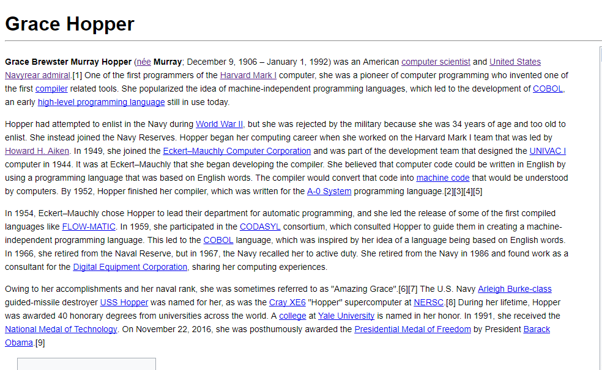
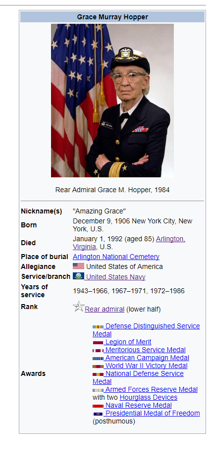
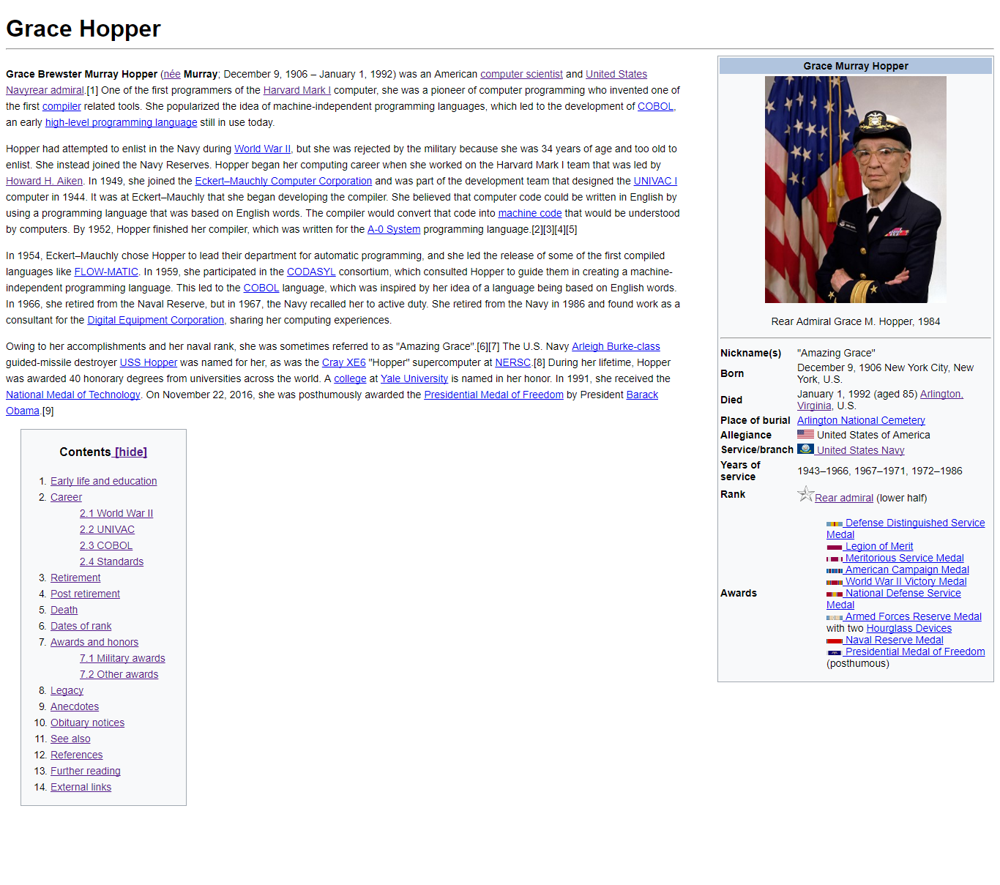

#### PROYECTO: GRACE HOPPER ####

-------------------------------------------------------------
1.  __Introducción__

      El proyecto Grace Hopper trata sobre replicar una página de wikipedia donde se detalla en general sobre su vida.

2.  __Desarrollo de estructuctura html__

 * En primer lugar cree una estructura html la que dividí en tres partes para hacerlo más factible, la primera parte consta de el nombre de la página web,título,párrafos, el cual se detalla en la siguiente imagen:

 * En la segunda parte opté por avanzar el contenido donde se van a linkear los elementos para lo que cree un lista al aplicar ello se obtiene un resultado similar a la imagen:
 

 * Para finalizar realizé la siguiente parte que es la de la biografia y logros  cree una tabla en mi estructura html enla que estarían contenidos la parte del encabezado  y la parte del cuerpo de la tabla(tbody) dentro de ellas hay una lista y como se ve se agregan pequeñas imágenes.
 

3. __Aplicación de estilos con css__

 * básicamente esto me ayuda a acomodar los bloques: parte introductoria, parte de contenido y parte de biografia que vendria  a ser la tabla también realizamos cambio de letra de texto tamaño, en lantabla el borde y listo el resultado finalk será de la siguiente forma: 
